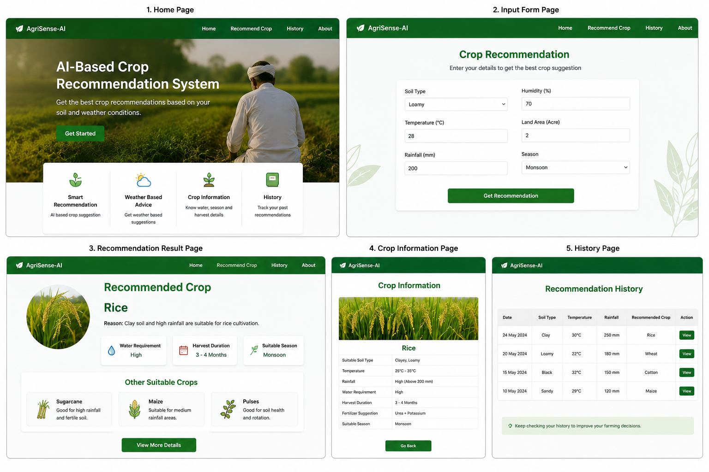

# 🌱 AI-Based Crop Recommendation System

## 📌 Project Overview

The AI-Based Crop Recommendation System is a smart agriculture web application developed to help farmers choose suitable crops based on environmental and land conditions.  

The system collects inputs such as:

- Soil Type
- Temperature
- Rainfall
- Humidity
- Season
- Land Area

Using simple AI-based rule logic, the system analyzes the data and recommends the most suitable crops for cultivation.

This project aims to support farmers in improving agricultural productivity and making better farming decisions.

---

# 🚀 Features

## ✅ Farmer Input Module

Farmers can enter:

- Soil Type
- Temperature
- Rainfall
- Humidity
- Season
- Land Area

---

## ✅ Crop Recommendation

The system recommends crops based on predefined conditions.

### Example:

- Clay Soil + High Rainfall → Rice
- Loamy Soil + Moderate Temperature → Wheat
- Black Soil + High Temperature → Cotton

---

## ✅ Crop Information

Displays:

- Crop Name
- Water Requirement
- Harvest Duration
- Suitable Season

---

## ✅ Fertilizer Suggestion

Provides fertilizer recommendations for crops.

### Example:

| Crop | Fertilizer |
|---|---|
| Rice | Urea + Potassium |
| Wheat | Nitrogen Fertilizer |
| Cotton | Organic Compost |

---

## ✅ Multiple Crop Suggestions

Suggests alternative crops for better farming decisions.

Example:

1. Rice  
2. Sugarcane  
3. Maize  

---
# 📸 Project Screenshots

## ✅ Weather Suggestions

Example:

> "Rainfall is high this season, rice cultivation is suitable."

---

# 🛠️ Technologies Used

## Frontend
- HTML
- CSS
- JavaScript

## Backend
- Java
- Spring Boot
---

# 🧠 AI Logic Used

This project uses simple rule-based AI logic instead of machine learning.
---
# 📂 Project Structure

AI-Crop-Recommendation-System
│
├── screenshots
│   └── project-ui.png
├── frontend
│   ├── index.html
│   ├── style.css
│   └── script.js
│
├── backend
│   ├── CropController.java
│   ├── CropService.java
│   ├── CropRequest.java
│   ├── CropResponse.java
│   └── CropRecommendationApplication.java
│
└── README.md
---
# ⚙️ System Flow

Farmer Input
     ↓
Frontend Form
     ↓
Java Backend Processing
     ↓
Rule-Based AI Analysis
     ↓
Crop Recommendation
     ↓
Result Display
---
# 📥 Sample Input
| Parameter   | Value   |
| ----------- | ------- |
| Soil Type   | Clay    |
| Temperature | 30°C    |
| Rainfall    | 250 mm  |
| Humidity    | 80%     |
| Season      | Monsoon |
---
# 📤 Sample Output
Recommended Crop: Rice

Reason:
Clay soil and high rainfall are suitable for rice cultivation.

Water Requirement:
High

Harvest Duration:
3-4 Months
---
# 🌾 Crop Dataset Example

| Crop   | Soil Type | Temperature | Rainfall |
| ------ | --------- | ----------- | -------- |
| Rice   | Clay      | 25–35°C     | High     |
| Wheat  | Loamy     | 15–25°C     | Medium   |
| Cotton | Black     | 25–35°C     | Medium   |
| Maize  | Sandy     | 20–30°C     | Low      |
---

# ✅ Advantages
-Easy to use
-Simple AI implementation
-Helps farmers choose suitable crops
-Improves productivity
-Reduces crop failure risks
-Supports smart farming

---
# 🔮 Future Enhancements
-Real-time weather API integration
-Machine Learning based prediction
-Mobile application support
-Multi-language support
-Soil testing integration
-Market price prediction
-Farmer login system
---
#📸 Output Screens
## Home Page
--Project introduction
--Navigation options
## Farmer Input Form
--Input agricultural details
## Recommendation Page
--Recommended crop
--Water requirement
--Harvest duration
--Fertilizer suggestion
---

#🎯 Conclusion
-The AI-Based Crop Recommendation System is a smart agriculture solution designed to help farmers make informed farming decisions using environmental and soil data.

-The project demonstrates the practical implementation of:
-Web Development
-Java Backend Development
-Rule-Based Artificial Intelligence
-This system aims to support efficient and modern agricultural practices.
